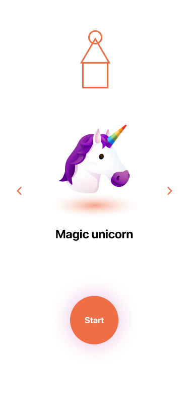
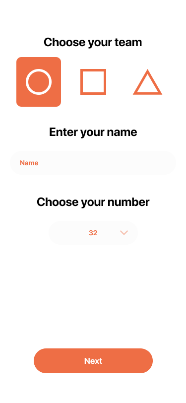
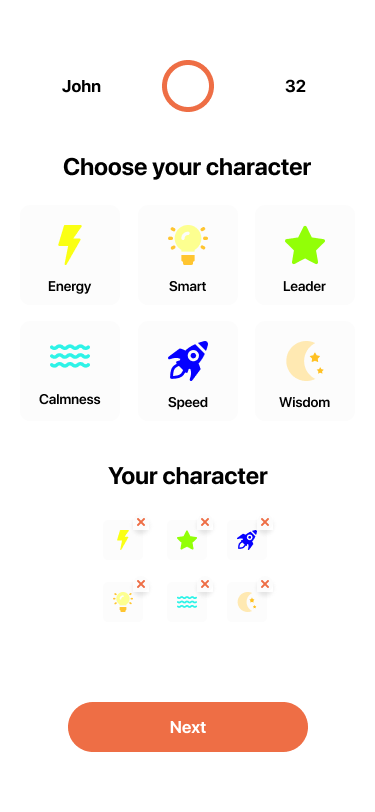

# React Native Test Project

Basic react native project based on typescript template

## Running

Clone the repository and run the following commands

### iOS

`yarn ios`

### Android

`yarn android`

## Project Structure

<pre>
📁 <b>src</b> - <i>contains JS-side sources</i>
┣ 📁 <b>assets</b> - <i>contains images, icons, fonts, and other assets</i>
┣ 📂 <b>components</b> - <i>contains all reusable components</i>
┃ ┣ 📂 <b>Button</b> - <i>example of a component</i>
┃ ┃ ┗ 📜 <b>index.tsx</b> - <i>contains the `Button` component implementation</i>
┃ ┗ 📜 <b>index.tsx</b> - <i>contains exports of all components</i>
┣ 📂 <b>navigation</b> - <i>contains navigation stacks and related items</i>
┃ ┗ 📜 <b>index.tsx</b> - <i>root navigation stack</i>
┣ 📂 <b>screens</b> - <i>contains screen components</i>
┃ ┣ 📂 <b>Initial</b> - <i>example of a screen</i>
┃ ┃ ┗ 📜 <b>index.tsx</b> - <i>contains the `Initial` screen implementation</i>
┃ ┗ 📜 <b>index.tsx</b> - <i>contains exports of all screens</i>
┗ 📂 <b>utils</b> - <i>contains utility functions</i>
</pre>

## Application

| Initial Screen               | Team Screen               | Character Screen               |
| ---------------------------- | ------------------------- | ------------------------------ |
|  |  |  |

#### Initial Screen

User should be able to choose an avatar from the list of emojis and navigate to the next screen. The app remembers the selection but does not interact with the server.

#### Taeam Screen

User should be able to select one of the three available teams, enter his name, select a number and go to the next screen. The app sends data to the server.

#### Character Screen

User can see the title of the screen with his name, team and number. User should be able to choose an unlimited number of characteristics. The app sends data to the server.

## Links

App layouts on [Figma](https://www.figma.com/file/qzNAwyn3we2jN8vfqViY9y/Test)
